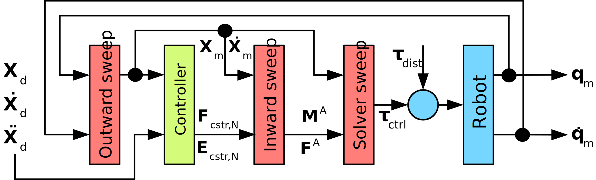

# Background

The kinematics and dynamics of manipulators are among the oldest problems in robotics. Their objective is to answer queries such as "where is a robot's end-effect with respect to the base" or "how much torque to apply to the joints to achieve a desired end-effector motion". Efficient solvers to such queries dispatch computations along the kinematic chain to propagate physical quantities such as positions, velocities, acceleration, forces or inertia in so called _sweeps_ or traversals.

|            |
|:--------------------------------------------------:|
| Figure 1: Solver and control loop [^Schneider2019] |

We have recently identified and described common problems in the design of such solvers and their integration in overall robotic software architectures [^Schneider2019]. The figure above shows a typical control loop for a manipulator. It features

* the position ($K_p$) and velocity ($K_v$) controllers via the green elements
* a forward position kinematics (FPK), forward velocity kinematics (FVK) and an acceleration-constrained hybrid dynamics (ACHD) solver via the red boxes
* the environment as the robot and its external disturbances via the blue elements

Due to the cyclic nature of the control loop there exists a mutual dependency between the controller and the solver. Therefore, solvers repeat computations: the FVK solver internally solves the FPK problem while the ACHD contains the computations of the FVK and hence also the FPK. Thus, in the above paper we suggest refactoring the solvers so to

* Interleave further computations, such as control or estimation, with the solvers
* Reuse existing state by treating the kinematic chain and its state as the robot's simplest world model
* Propagate the motion drivers (acceleration constraints, external forces and feedforward joint forces) separately and then compose them flexibly during the last outward, _solver_ sweep

The figure below demonstrates how the refactored control loop from the previous figure could look like.

|                 |
|:-------------------------------------------------------------:|
| Figure 2: Refactored solver and control loop [^Schneider2019] |

For our previous work we had developed an ad-hoc proof-of-concept implementation. Hence, with `kindyngen` we provide a toolchain that allows to generate correct-by-construction applications from models. Here, we focus on the Recursive Newton-Euler Algorithm [^Featherstone2008] as the dynamics solver where we separate the propagation of the inertial force from the external force.

[^Schneider2019]: Sven Schneider and Herman Bruyninckx, "Exploiting linearity in dynamics solvers for the design of composable robotic manipulation architectures", in Proc. of the IEEE International Conference On Intelligent Robots and Systems (IROS), 2019.

[^Featherstone2008]: Roy Featherstone, "Rigid Body Dynamics Algorithms", Springer, 2008.