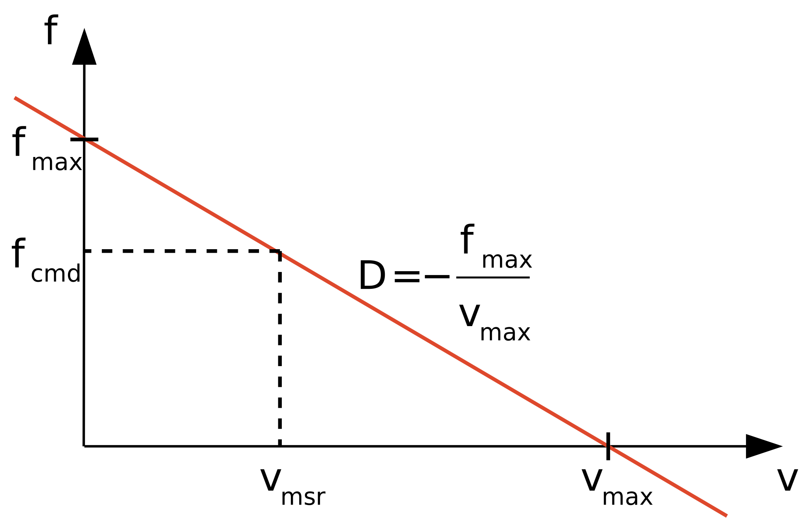

# Cartesian control

Most users of a robot want to describe tasks in Cartesian space. Hence, in this tutorial we will implement a simple, linear impedance controller [^impedance-contoller] to regulate the artificial force to be exerted on the robot's end-effector. Here, we connect this controller to the robot's end-effector via the RNE's external force interface. The objective is to apply a torque on the end-effector so that it should rotate when not constrained.

[^impedance-contoller]: An impedance controller maps from the motion domain to the force domain. The impedance relations are known as _stiffness_ (position to force), _damping_ (velocity to force) and _inertia_ (acceleration to force).


## Controller design

The controller should realize a desired (maximum) end-effector velocity while simultaneously limiting the force. We achieve this by a constant damping controller where the damping $D$ is calculated from a maximum force ($f_{max}$) and a maximum velocity ($v_{max}$). The commanded force ($f_{cmd}$) is computed given the measured velocity ($v_{msr}$) via the following formula:
$$f_{cmd} = f_{max} + D \cdot v_{msr} = f_{max} - \dfrac{f_{max}}{v_{max}} v_{msr}$$

The resulting behaviour is best understood by first considering the two "extreme" cases and then the general case:

* $v_{msr} = 0$: the controller commands the maximum permissible force. If the system is not in a contact situation it will accelerate, otherwise it will only exert the maximum force onto the environment.
* $v_{msr} = v_{max}$: the controller commands no force and, hence, does not accelerate the system. Most likely external effects such as friction will brake the system.
* Otherwise: the controller commands a force that is proportional to the difference from the maximum velocity, offset by the maximum permissible force. The damping represents the proportionality factor.

The following figure depicts this behaviour.

|  |
|:-----------------------------------------------------:|
|            Figure 5: Impedance controller             |


## Traverser: mounting the controller in the graph

The synthesizer steps live in the [`my_contoller_steps.py`](https://github.com/comp-rob2b/kindyngen/kindynsyn_tutorial/my_contoller/my_controller_steps.py) module. Here, the traverser is similar to the ones from the previous tutorial, but it (i) relies on a custom expansion query; and (ii) employs an additional configuration method:

```python
ctrl_expand = """
PREFIX ex-ctrl: <https://example.org/ctrl#>

SELECT ?child ?parent WHERE {
    ?node ^ex-ctrl:attached-to ?child .
    BIND(?node as ?parent)
}
"""

...

def traverse(self):
    return Traverser(
        expander=ctrl_expand,
        edge=[Dispatcher(None, self.configure_ede, self.compute_edge)]
    )
```

A controller is assumed to point to a frame via the `ex-ctrl:attached-to` property. Hence, the expansion query tries to find such a controller by following that property in the opposite direction (`^`).


## Configuration: declaring and caching data

Previously we have already encountered the `state` parameter of the configuration and compute functions that relied on built-in state representations. For the controller we want to introduce a custom state to capture the controller's output. We achieve this by adding a [dataclass](https://docs.python.org/3/library/dataclasses.html) with the single field `wrench` (of type `URIRef` or `None`) that has a default value of `None`:
```python
@dataclass
class MyCartesianControllerState:
    wrench: URIRef | None = field(default=None)
```

We connect controller's output ($f_{cmd}$) to the external force exerted on the end-effector. To this end, during the configuration, we first declare the wrench data. Then we tag it as an external force specification, so that the RNE's external force propagation can find it:
```python
def configure_edge(self, state, parent, child):
    par = state[parent][ChainIndexState]

    wrench = self.dyn.wrench(acts_on=par.bdy, as_seen_by=par.frm_prox,
        number_of_wrenches=1)

    ext = uuid_ref()
    self.g.add((ext, RDF["type"], SPEC["ExternalForce"]))
    self.g.add((ext, SPEC["force"], wrench))
    ...
```

Note, that (i) the wrench is expressed locally to the link (`as_seen_by=par.frm_prox`); and (ii) only consists of a single number of wrench instances (`number_of_wrenches=1`).

Next, we cache that data so that it is efficiently accessible during the computation:
```python
    ...
    s = MyCartesianControllerState()
    s.wrench = wrench

    state[child][MyCartesianControllerState] = s
    ...
```

Finally, don't forget to register the wrench data with the algorithm so that the according data blocks can be generated in the algorithm representation:
```python
    ...
    self.algo["data"].extend([wrench])
```

## Computation: emitting closures

The computation introduces no new concepts beyond the previous tutorial and is only listed for completeness:
```python
def compute_edge(self, state, parent, child):
    vel = state[parent][VelocityPropagationState]
    ctrl = state[child][MyCartesianControllerState]

    damp = self.my_damper(
        velocity_twist=vel.xd_tot,
        wrench=ctrl.wrench)

    self.algo["func"].extend([damp])

def my_damper(self, velocity_twist, wrench):
    id_ = uuid_ref()
    self.g.add((id_, RDF["type"], EX_CTRL["Damping"]))
    self.g.add((id_, EX_CTRL["max-velocity"], Literal(0.1)))
    self.g.add((id_, EX_CTRL["max-force"], Literal(2.0)))
    self.g.add((id_, EX_CTRL["velocity-twist"], velocity_twist))
    self.g.add((id_, EX_CTRL["wrench"], wrench))
    return id_
```

> **_NOTE:_**
>
> In the interest of keeping the tutorial more concise and focused on the software, we have opted for a (too) simplistic controller model and synthesizer implementation. In particular, the `max-velocity` and `max-force` properties are just configured numbers and hence lack ...
>
> * ... a value per degree of freedom
> * ... a coordinate-free representation
> * ... physical units and a reference to a coordinate frame
> * ... semantic checks (because of the previous two points)
> * ... reification as a runtime-accessible data block.
>
> The modules in the `kindynsyn` package contain more complete modules that try to avoid such issues.


## Solver and translator configurator

The synthesizer that includes the controller (see [`rne_slv_robif_ctrl.py`](https://github.com/comp-rob2b/kindyngen/kindynsyn_tutorial/rne_slv_robif_ctrl.py)) is an extension with respect to the previous tutorial. First, we require an additional propagation step of the external forces and need to include those external forces in the joint force accumulation:
```python
...
ext_prop = QuasiStaticExternalForcePropagationStep(g, cache, slv_algo,
    dyn_coord, dyn, kc, kc_stat)

my_slv = MySolverStep(g, slv_algo, [
    QuasiStaticInertialForcePropagationState,
    QuasiStaticExternalForcePropagationState
])
...
```
Notice that this accumulation was the main reason for introducing this custom solver step in the previous tutorial.

Next, we can attach a controller to the end-effector using the `attached-to` property and instantiate the controller step:
```python
...
g.add((ROB["my-ctrl"], EX_CTRL["attached-to"], ROB["link7-root"]))
my_ctrl = MyCartesianControllerStep(g, slv_algo, dyn)
```

Then, accomodate for the two new steps in the sweep configuration by appending ...
1. ... the controller to the first outward sweep
2. ... the external force propagation to the inward sweep

```python
out_1 = SweepConfig(
    direction=SweepDirection.OUTWARD,
    steps=[..., my_ctrl])
in_1 = SweepConfig(
    direction=SweepDirection.INWARD,
    steps=[..., ext_prop])
...
```

Finally, don't forget to append a translator instance to the return value of the `translator_configurator` function:
```python
def translator_configurator():
    return [
        ...
        MyCartesianControllerTranslator()
    ]
```


## Code generator

The code generator template for the `ex-damping` type controller lives in the [`my_controller.stg`](https://github.com/comp-rob2b/kindyngen/models/fragments/my_controller.stg) fragment and simply emits a function call:
```stg
...
ex-damping(args) ::= <<
my_controller(<args.max-velocity>, <args.max-force>, <args.velocity-twist>, <args.wrench>)
>>
```

Additionally, the fragment contributes the implementation of the controller as discussed [before](#controller-design) but only applies that controller to the "angular-z" degree of freedom:
```stg
...
controller-definition() ::= <<
void my_controller(
        double max_velocity,
        double max_force,
        const double *restrict velocity,
        double *restrict force)
{
    const double DAMPING = -max_force / max_velocity;

    for (int i = 0; i \< 3; i++) {
        force[DYN2B_WRENCH3_LIN_OFFSET + i] = 0.0;
        force[DYN2B_WRENCH3_ANG_OFFSET + i] = 0.0;
    }

    double v = velocity[DYN2B_WRENCH3_ANG_OFFSET + DYN2B_Z_OFFSET];
    force[DYN2B_WRENCH3_ANG_OFFSET + DYN2B_Z_OFFSET] = max_force + DAMPING * v;
}
>>
```


## Build and execute

To build the associated artefacts execute:
```bash
cd <kindyngen>
python kindynsyn_tutorial/runner.py rne_slv_robif_ctrl
cd <kindyngen>/code_generator
```

Now there are two code generator targets available. The first one prints the resulting torques to the terminal ...
```bash
make tutorial-dyn2b-slv-print-ctrl
```
... whereas the second one interfaces with a real robot using the robif2b library:
```bash
make tutorial-dyn2b-slv-robif2b-ctrl
```

Upon either choice compile the code and execute the resulting software as before:
```bash
cd <kindyngen>/gen
cmake .
make
./main
```
