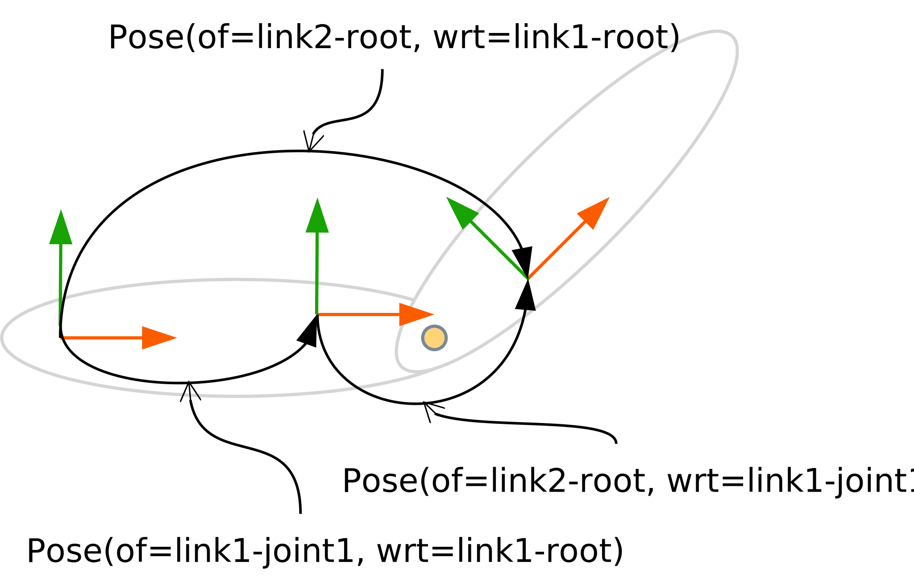

# Tutorial: Configuring solvers

## Forward position kinematics

In the [previous section](getting_started.md) we have shown the common parts of the tutorial to synthesize a solver. Here, we will investigate the variation points (solver configuration and translator) for one of the most simple solvers -- the forward position kinematics (FPK) -- as implemented in [`fpk.py`](https://github.com/comp-rob2b/kindyngen/kindynsyn_tutorial/fpk.py). It relies on two steps that are already part of the `kindynsyn` library, the `PositionPropagationStep` and the `PositionAccumulationStep`. The former emits all models of data and functions to the graph that are required to compute the pose between the root frames of two adjacent segments. In the example figure below, we see the three relevant pose relations:

* `Pose(of=link1-joint1, wrt=link1-root)`: this pose originates from the kinematic chain model and determines the joint's location on the link.
* `Pose(of=link2-root, wrt=link1-joint)`: this pose is the joint's active contribution and must be computed at runtime given the current joint position as well as the joint model. In other words, it represents the solution to the joint's forward position kinematics. This forward position kinematics operator is the first function emitted by the `PositionPropagationStep`.
* `Pose(of=link2-root, wrt=link1-root)`: this pose is the composition of the previous two poses. Hence, the associated composition operator is the second function emitted by the `PositionPropagationStep`.

|  |
|:-----------------------------------------------------:|
| Figure 3: Pose relations associated with two segments |

The `PositionAccumulationStep` emits one more composition operator to compute the current segment's pose with respect to the robot's base. For example, related to the figure above and assuming that the robot's base is chosen as the frame `link0-root`, the step would ...

* ... compute `Pose(of=link2-root, wrt=link0-root)` ...
* ... given the `Pose(of=link1-root, wrt=link0-root)`, and ...
* ... given the output from the previous `PositionPropagationStep`

In code this is implemented as follows:
```python
...
def solver_configurator(g, cache, ROB, slv_algo):
    frm_world = ROB["world-frame"]

    # Instantiate factories
    geom_rel = SpatialRelations(g)
    geom_coord = SpatialRelationsCoordinates(g)
    geom = SpatialRelationsWithCoordinates(geom_rel, geom_coord)
    kc = KinematicChainOperators(g)

    # Instantiate "standard" solver steps
    index = ChainIndexStep(g, cache, frm_world)
    j_mot = JointStep(g, cache, slv_algo)
    pos_prop = PositionPropagationStep(g, cache, slv_algo, geom, geom_coord, kc)
    pos_acc = PositionAccumulationStep(g, cache, slv_algo, geom, geom_coord)

    # Configure solver
    out_1 = SweepConfig(
        direction=SweepDirection.OUTWARD,
        steps=[index, j_mot, pos_prop, pos_acc])

    return SolverConfig(sweeps=[out_1])
```

Apart from the already mentioned `PositionPropagationStep` and `PositionAccumulationStep`, we see two auxiliary steps:

* `ChainIndexStep`: this represents an index or cache of frequently-used entities from the kinematic chain model such as the IDs of the segment's frames or the segment's joint. Later steps can refer to this cache instead of directly interacting with the graph.
* `JointStep`: this represents another cache, but this time for the joint state of the kinematic chain, i.e. it retains the joints' motion ($q$, $\dot{q}$, $\ddot{q}$) and force variables ($\tau$).

All steps are parameterized with the rdflib graph `g` and the SPARQL `cache`. Additionally, they receive as arguments various factories that contain adaptors to emit data into the rdflib graph. That data can represent spatial relations, their coordinate representation but also operators thereupon.

At the end we compose all steps into a `SweepConfig`, the declarative representation of a "sweep template". We call it a "sweep template", because steps could only be conditionally instantiated at very specific nodes in the graph (this will be discussed in a following tutorial). Here, we only need a single outward sweep with the steps ordered as shown. The order is relevant because of the (data) dependency relations between the steps. For example, the indices or caches must be setup before being accessed by further steps and, similarly, the relative segment-to-segment pose must be known before it can be accumulated with the global root-to-segment pose. The overall solver can consist of multiple sweeps that are composed in the `SolverConfig`.

Since we have only used concepts that are built-in to `kindynsyn`, no additional translators will be required for `IRGen`. Thus, we can simply return an empty list of translators:
```python
def translator_configurator():
    return []
```

Now we can execute the synthesizer and code generator as explained before:
```bash
cd <kindyngen>
python kindynsyn_tutorial/runner.py fpk
cd <kindyngen>/code_generator
make tutorial-dyn2b
cd <kindyngen>/gen
cmake .
make
./main
```

However, this program does neither produce any robotic behaviour nor any visible output because the solver is not connected to any consumers or sinks. We will address this in the next tutorial.


## Recursive Newton-Euler inverse dynamics

The tutorial module also features a more complicated, RNE inverse dynamics solver in [`rne.py`](https://github.com/comp-rob2b/kindyngen/kindynsyn_tutorial/rne.py). We notice how the RNE extends the FPK by adding ...

* ... more steps to first, outward sweep. Those steps effectively compute the forward velocity kinematics and the forward acceleration kinematics.
* ... a second, inward sweep. This sweep propagates inertial forces inwards, from the leafs to the root.

```python
def solver_configurator(g, cache, ROB, slv_algo):
    ...
    vel_prop = VelocityPropagationStep(g, cache, slv_algo, geom, geom_coord, kc)
    acc_prop = AccelerationPropagationStep(g, cache, slv_algo, geom, geom_coord, kc)
    rbi = RigidBodyInertiaStep(g, cache, slv_algo, dyn)
    f_nrt = InertialForceStep(slv_algo, dyn_coord, dyn)
    nrt_prop = QuasiStaticInertialForcePropagationStep(slv_algo, dyn_coord, dyn, kc, kc_stat)

    out_1 = SweepConfig(
        direction=SweepDirection.OUTWARD,
        steps=[index, j_mot, j_dyn, pos_prop, pos_acc, vel_prop, acc_prop])
    in_1 = SweepConfig(
        direction=SweepDirection.INWARD,
        steps=[rbi, f_nrt, nrt_prop])

    return SolverConfig(sweeps=[out_1, in_1])
```

To build the associated artefacts execute:
```bash
cd <kindyngen>
python kindynsyn_tutorial/runner.py rne
cd <kindyngen>/code_generator
make tutorial-dyn2b
cd <kindyngen>/gen
cmake .
make
./main
```

Again, the program does not produce any visible output.
