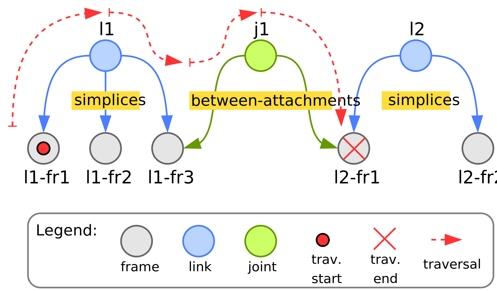

# Tutorial: solver sweep & robot interface

The previous tutorial configured various solvers using only built-in functionality. In this tutorial we compose new functionality onto the RNE solver: a solver sweep that accumulate joint forces from multiple sources (see [`my_solver`](https://github.com/comp-rob2b/kindyngen/kindynsyn_tutorial/my_solver)) and an interface to a robot (see [`my_robot_interface`](https://github.com/comp-rob2b/kindyngen/kindynsyn_tutorial/my_robot_interface)).

## Solver sweep

### Synthesizer

#### Vocabulary

First, any package should define the relevant graph concepts -- the vocabulary -- using an rdflib `DefinedNamespace` (see [`namespace.py`](https://github.com/comp-rob2b/kindyngen/kindynsyn_tutorial/my_solver/namespace.py)). The `DefinedNamespace` raises a warning when an "undefined" term is used. Alternatively, rdflib's `Namespace` allows defining concepts on-the-fly, without raising such a warning.

```python
class MY_SLV(DefinedNamespace):
    AccumulateJointForce: URIRef

    sources: URIRef
    destination: URIRef

    _NS = Namespace("https://example.org/my-solver#")
```

Here, we require the type `AccumulateJointForce` with imposes two properties `sources` -- to represent the list of symbolic pointers to the input joint forces -- and `destination` -- to represent the symbolic pointer to the accumulated joint force. The vocabulary is identified via the IRI [https://example.org/my-solver#](https://example.org/my-solver#).


#### Step & traverser

The following code snippet shows an excerpt from [`my_solver_steps.py`](https://github.com/comp-rob2b/kindyngen/kindynsyn_tutorial/my_solver/my_solver_steps.py) to define a custom step class.


```python
class MySolverStep:
    def __init__(self, g, algo, source_classes):
        self.g = g
        self.algo = algo
        self.source_classes = source_classes

    def traverse(self):
        disp = Dispatcher(condition=None, configure=None,
            compute=self.compute_edge)

        return Traverser(expander=q_expand, edge=[disp])
    ...
```

The class has a constructor (`__init__` function) with the following parameters:

1. `g`: the rdflib graph that contains the kinematic chain model to which the steps can compose custom data blocks or function blocks.
2. `algo`: a dictionary with the two entries `data` and `func`, both of which are lists to pass any instantiate data block or function block back to the synthesizer (cf. [Synthesizing a solver algorithm](https://github.com/comp-rob2b/docs/getting_started.md#synthesizing-a-solver-algorithm)).
3. `source_classes`: a list of all classes from which the solver sweep should get and accumulate the joint forces.

The `traverse` function turns this class into a `kindynsyn` step via [duck typing](https://en.wikipedia.org/wiki/Duck_typing). It first instantiates a `Dispatcher` with takes three arguments. First, a condition which must be a SPARQL query or `None` and must evaluate to `true` for the dispatcher to activate. In kinematics and dynamics solvers, one often must perform special computations at the kinematic chains root or its leaves. This allows, for example, initializing the root's acceleration to gravitational acceleration or initializing the to-be-propagated forces at leave segments. Then the dispatcher declares which functions to call, i.e. where to _dispatch_ to. We foresee two types of functions: `configure` and `compute`. The former is meant to declare or allocate any required data blocks, whereas the latter should emit function blocks to perform actual computations at runtime.

Once one or more dispatchers are configured, we can connect them to (i) a graph expansion query; and (ii) either the nodes of this expansion or the edges (only the edge version is shown above) using a `Traverser` instance. The node vs. edge difference is relevant for kinematics and dynamics solvers because some computations pertain to frame entities (the nodes) whereas other pertain to the relation between frames (the edges). An example of the former is the computation of inertial forces from known accelerations. An example of the latter is the propagation of physical quantities such as positions, velocities or accelerations from one frame to another.

In the above example we reuse the `q_expand` query to expand the graph. It is defined as follows:

```sparql
PREFIX geom-ent: <https://comp-rob2b.github.io/metamodels/geometry/structural-entities#>
PREFIX kc-ent: <https://comp-rob2b.github.io/metamodels/kinematic-chain/structural-entities#>

SELECT ?child ?parent WHERE {
    ?node ^geom-ent:simplices / geom-ent:simplices ?joint_prox .
    FILTER (?node != ?joint_prox)
    ?joint_prox ^kc-ent:between-attachments / kc-ent:between-attachments ?child .
    FILTER (?joint_prox != ?child)
    BIND(?node as ?parent)
}
```

First, the query defines two namespaces to allow for shorter notation (the `PREFIX` lines) and then starts the query definition via the `SELECT ... WHERE` statement that declares two return arguments named `?child` and `?parent`. We explain how the core query works along the following figure. The query is applied to a `?node` whose ID `kyndynsyn` passes to the query (in the example figure this would be the frame `l1-fr1`). Then the query follows any edge `geom-ent:simplices` in the opposite direction (indicated by the caret character `^`) to end up at a simplicial complex -- the most simple version of a rigid body or link -- which would be `l1` in the figure. From there it follows the `geom-ent:simplices` edge to end up at `l1-fr1`, `l1-fr2` _and_ `l1-fr3`. The first `FILTER` statement removes the start node from this set, so that the next line tries to follow any sequence of `kc-ent:between-attachments`, first in the inverse direction then in the forward direction, from the nodes `l1-fr2` and `l1-fr3`. This query is only applicable to `l1-fr3` but leads to the nodes `l1-fr3` and `l2-fr1`. Hence, the second `FILTER` statement removes the previously-visited node `l1-fr3` from the set so that only `l2-fr1` remains as the `?child`. Finally, the query assigns (`BIND`) the `?node` parameter to the `?parent` parameter which is an expected output.

|  |
|:----------------------------------------:|
|         Figure 4: Expansion query        |


Whenever this expansion query produces any non-empty output, i.e. it finds a node to expand to, `kindynsyn` will trigger the dispatchers as defined in the associated `Traverser`.


### Computation: emitting closures

Now we look into the `compute_edge` function for the joint force accumulator:
```python
    def compute_edge(self, state, parent, child):
        sources = []
        for source_class in self.source_classes:
            sources.append(state[child][source_class].tau)

        jnt = state[child][JointState]
        acc = self.accumulate_joint_force(sources, jnt.tau)

        self.algo["func"].extend([acc])
```

The first parameter is a state dictionary that, for each node, can contain structural state of the kinematic chain or computational state associated with the synthesized algorithm. The state parameter has a two-fold role. On the one hand, within a step, it can transfer data ("variable definitions") from the configuration to the computation. On the other hand, it can transfer data between different steps, as is the case in this example.

In the expansion query above we saw that we only visit frames, but here we want to perform a computation on a joint which lies _between_ two frames. This is the reason for dispatching to an edge handler and also why there are a `parent` and `child` parameter, both of which contain the graph ID (`URIRef`) of the respective node. Note, that depending on the direction of the sweep that the steps should be invoked in, the number of children differs. For an _outward_ sweep each child is visited separately and hence the function takes a single parent as well as a single child (cf. example above). Instead, for an _inward_ sweep the parent is visited and hence accepts a single parent as well as a list of children.

In the beginning, the function iterates over all defined states' `source_classes`. It collects the joint torque (`tau`) for each of those classes from the state associated with the child. Next, it obtains a handle to the `JointState` for the child, which will be used as the destination to emit the accumulated joint forces to as realized by the following `accumulate_joint_force` function (see below). Finally, the accumulation operator is appended to the list of function that form the overall synthesized algorithm.

`accumulate_joint_force` is an auxiliary function to emit data (here, a model of the accumulation operator) into the graph:
```python
    def accumulate_joint_force(self, sources, destination):
        lst = BNode()
        collection.Collection(self.g, lst, sources)

        id_ = uuid_ref()
        self.g.add((id_, RDF["type"], MY_SLV["AccumulateJointForce"]))
        self.g.add((id_, MY_SLV["sources"], lst))
        self.g.add((id_, MY_SLV["destination"], destination))
        return id_
```

To this end, the function transforms the list of sources (from where joint forces should be accumulated) to the rdflib list representation. Then it creates a new identifier, a [Universally Unique Identifier](https://en.wikipedia.org/wiki/Universally_unique_identifier) (UUID), for the operator and associates it with its `type`, the `sources` and `destination` as defined in the [vocabulary](#vocabulary).


### IR generator

The next objective is to implement a custom translator from the graph to the IR. The code is available in the [`my_solver_gen.py`](https://github.com/comp-rob2b/kindyngen/kindynsyn_tutorial/my_solver/my_solver_gen.py) module:
```python
class AccumulateJointForceTranslator:
    @staticmethod
    def is_applicable(g, node):
        return set([MY_SLV["AccumulateJointForce"]]) <= set(g[node : RDF["type"]])

    @staticmethod
    def translate(g, node):
        l = list(collection.Collection(g, g.value(node, MY_SLV["sources"])))

        sources = list(map(lambda v: escape(qname(g, v)), l))
        destintation = escape(qname(g, g.value(node, MY_SLV["destination"])))

        return {
            "represents": str(node),
            "name": escape(qname(g, node)),
            "operator": "ex-accumulate-joint-force",
            "sources": sources,
            "destination": destintation
        }
```

Each translator must provide two methods (either as true method or [static method](https://docs.python.org/3/library/functions.html#staticmethod)): `is_applicable` and `translate`. Both methods take two arguments, the overall rdflib graph `g` from which to obtain data and the current (candidate) `node` to be translated. The former method returns a boolean result to indicate whether the translator can handle this node (e.g. by inspecting its type or other properties). The latter method performs the actual translation. Here, the translation entails the creation of a Python dictionary that can straightforwardly be mapped to JSON. Hence, we transform the list representation and shorten (via the `qname` function) as well as escape identifiers (e.g. `http://` would not be a valid variable name in C or Python).


### Code generator

The code generator fragment ([`my_solver.stg`](https://github.com/comp-rob2b/kindyngen/models/templates/fragments/my_solver.stg)) for the joint force accumulator is extremely simple and consists of the following three lines:
```stg
ex-accumulate-joint-force(args) ::= <<
<args.destination>[0] = <args.sources:{s | <s>[0]}; separator=" + ">
>>
```

The first line defines the rule with a single (composite) argument `args`. Note that rule's name must match the `operator` name in the IR. `<<` and `>>` are the rule delimiters. The second line determines the actual code that should be emitted. `<` and `>` represent instructions specific to StringTemplate. In particular does `<args.destination>` access the `destination` field in the `args` object and emit the associated value. The `sources` field is actually a list. Hence, we want to apply a sub-template to each entry of that list which StringTemplate realizes with the map operator `:`. In the following braces follows an anonymous template rule with a single argument `s` which just emits that argument followd by the string `[0]`, i.e. an array index operation in C. Finally, we want to add all entries in the array which we achieve by separating them with the string ` + `.

As a concrete example, the following JSON object ...
```json
{
    "operator": "ex-accumulate-joint-force",
    "sources": [ "a", "b" ],
    "destination": "c"
}
```
... would result in `c[0] = a[0] + b[0]`.


## Robot interface

The [robot interface](https://github.com/comp-rob2b/kindyngen/kindynsyn_tutorial/my_robot_interface) does not introduce new concepts beyond those from the above solver sweep. To this end, we keep the description in this tutorial brief. The module introduces two new steps, one for reading positions or velocities from the robot and the other to write control torques to the robot. Additionally, it provides the associated vocabulary and the IR generator backend.

However, we introduce two code generators. The first one (cf. [`robif_print.stg`](https://github.com/comp-rob2b/kindyngen/models/templates/fragments/robif_print.stg)) sets static values for the joint position and velocity measurements (not shown here), but prints the control torques to the terminal via the following rule:
```stg
...
joint-force-from-solver(args) ::= <<
<print-variable(args.source, variables)>
>>
```

The second code generator (cf. [`robif2b.stg`](https://github.com/comp-rob2b/kindyngen/models/templates/fragments/robif2b.stg)), on the contrary, implements a proper interface to a robot using the `robif2b` library. Here, the control torque interface defines the following two rules that establish the data exchange between the solver and the library:
```stg
robif2b-variables() ::= <<
double eff_cmd[] = { 0.0, 0.0, 0.0, 0.0, 0.0, 0.0, 0.0 };
...
struct robif2b_kinova_gen3_nbx rob = { 
    ...
    .jnt_trq_msr = eff_msr,
    ...
};
>>
...

joint-force-from-solver(args) ::= <<
eff_cmd[<args.destination-index>] = <args.source>[0]
>>
```

> **_NOTE:_**
>
> The `robif2b` code generator fragment hardcodes the connection details and user credentials for now and may require adaptations for the real robot at hand. A more advanced version should provide those parameters via explicit models.


## Application template

The application context, i.e. the top-level code generator rule, for printing the resulting torques to the terminal is located in [`tutorial_dyn2b_slv_print.stg`](https://github.com/comp-rob2b/kindyngen/models/templates/applications/tutorial_dyn2b_slv_print.stg) and defines the main function as follows:
```stg
import "../models/templates/fragments/algorithm_c.stg"
import "../models/templates/fragments/dyn2b.stg"
import "../models/templates/fragments/my_solver.stg"
import "../models/templates/fragments/robif_print.stg"
import "../models/templates/fragments/print.stg"


application(data-types, variables, input, output, local, closures, schedule) ::= <<
<dyn2b-include()>
<robif-print-include()>
<print-include()>

int main()
{
    <local:{id | <define-variable(id, variables.(id))>}:stmt(); separator="\n">

    <schedule:schedule(closures):stmt(); separator="\n">

    return 0;
}
>>
```

We see StringTemplate `import` instructions to load the fragments (e.g. the `my_solver.stg` and the `robif_print.stg` as described in this tutorial). `application` is the name of the generator rule with the listed arguments. Next, some fragments require include directives for C's pre-processor. Finally, the key lines in the C main function are a definition of all required variables that are listed in the rule's `local` argument and the emission of the schedule, i.e. all instructions that represent the overall solver, by applying the `schedule` rule to the `schedule` argument.


## Build and execute

To build the associated artefacts execute:
```bash
cd <kindyngen>
python kindynsyn_tutorial/runner.py rne_slv_robif
cd <kindyngen>/code_generator
```

Now there are two code generator targets available. The first one prints the resulting torques to the terminal ...
```bash
make tutorial-dyn2b-slv-print
```
... whereas the second one interfaces with a real robot using the robif2b library:
```bash
make tutorial-dyn2b-slv-robif2b
```

Upon either choice compile the code and execute the resulting software as before:
```bash
cd <kindyngen>/gen
cmake .
make
./main
```

The program should either print some values to the terminal or execute a plain gravity compensation behaviour on a connected, real robot.
